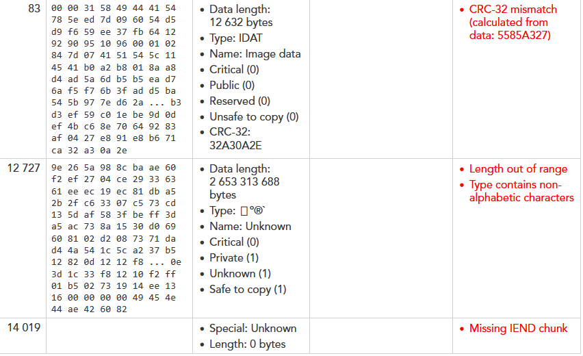

# A Mystery File

## Category
Crypto

## Estimated difficulty
Easy

## Description
The participants have to perform ROT13 on the letters and ROT5 on the numbers of the provided file.

## Scenario
I'm not sure what happened, but I swear it was an image at some point.

## Write-up
The challenge presents an unknown file format:

- When looking at the file in a hexadecimal editor, the file header shows the symbols 'CAT'. As the challenge description indicated, we are looking for an image (GIF, PNG, JPEG, BMP, etc.) instead. 'CAT' happens to be the ROT13 encoding of 'PNG'. Reapplying a ROT13 encoding on the file can be done like this:

`cat ./challenge | tr 'A-Za-z' 'N-ZA-Mn-za-m' > ./challenge.png`

- However, we get a broken PNG image. By loading this image into [an online inspector](https://www.nayuki.io/page/png-file-chunk-inspector), we see that some errors pop up. The checksum is not correct and the indicated length of the next chunk goes out of range.

- If we look at the file and calculate the right length for the IDAT chunk ourselves (see [PNG file format](http://www.libpng.org/pub/png/spec/1.2/PNG-Structure.html)), we get a length of 0x3658 instead of the given 0x3158. In ASCII representation, this shows as '6X' instead of '1X'. By applying ROT5 on the numbers in the file, we recover the original PNG image containing the flag.

`cat ./challenge.png | tr '0-9' '5-90-4' > ./solution.png`

## PoC script
`cat ./challenge | tr 'A-Za-z0-9' 'N-ZA-Mn-za-m5-90-4' > ./solution.png`

## Flag
CSC{X4phBNhb2nzarq6R}

## Creator
Jelle Aerts

## Creator bio
--
