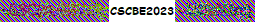

# Unbreakable Encryption

## Category
Crypto

## Estimated difficulty
Easy

## Description
The participants have to XOR the bitmap data with the key provided in the image.

## Scenario
This image seems to contain a secret, but it has been encrypted...

## Write-up
The challenge presents a BMP image that contains a distorted image and some text:

- The title of this challenge contained a hint: it refers to one-time-pad encryption which is unbreakable if the key has the same length as the message and has never been used before. On binary data, this encryption is done by the XOR operation. Clearly, the image did not use a key of the right length as some text can be recognized although it is unreadable.

- As the file itself can be opened and viewed, it means that the file header is still intact, i.e. only the image data has been encrypted. When investigating the [BMP file format](https://www.ece.ualberta.ca/~elliott/ee552/studentAppNotes/2003_w/misc/bmp_file_format/bmp_file_format.htm) and using a hexadecimal editor, we can see that the image data for this file starts at an offset of 0x436: 0x36 (color table offset) + 0x400 (256 colors * 4 bytes = 1024).

- By XOR'ing the image data from 0x436 until the end of the file with the provided key `CSCBE2023` ([CyberChef recipe](https://gchq.github.io/CyberChef/#recipe=From_Hex('Auto')XOR(%7B'option':'Hex','string':'CSCBE2023'%7D,'Standard',false)To_Hex('Space',0))), we can decrypt the contents and read the flag.

## PoC script
N/A

## Flag
CSC{4LGBU43yU29cYZrp}

## Creator
Jelle Aerts

## Creator bio
--
