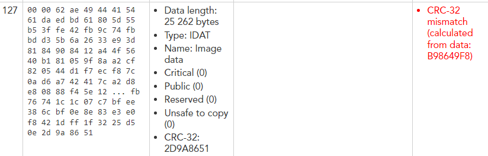
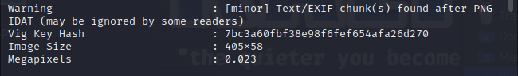
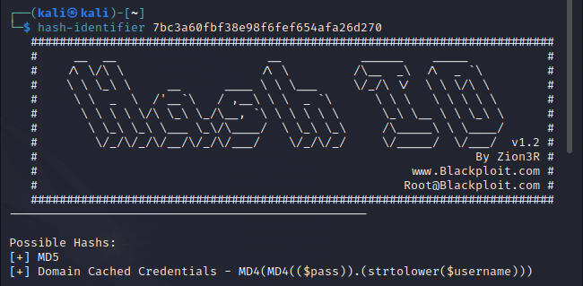
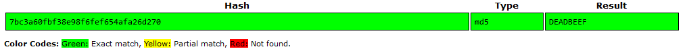

# Pseudo PNG

## Category
Crypto

## Estimated difficulty
Medium

## Description
The participants have to decrypt the PNG IDAT chunk using a Vigenère cipher with the hashed key hidden in a PNG TEXT chunk.

## Scenario
The image has been encrypted in some way, can you decrypt it?

## Write-up
The challenge presents a blank PNG image:

- By looking at the file in a hexadecimal editor and referring to the [PNG file format](http://www.libpng.org/pub/png/spec/1.2/PNG-Structure.html), we can see that the checksum of the IDAT chunk does not correspond the data. The same can be achieved using [an online PNG inspector](https://www.nayuki.io/page/png-file-chunk-inspector).

- Running `exiftool` on the file also reveals a PNG TEXT chunk named VigKeyHash.

- Using `hash-identifier` on the hash, we can see that it's probably an MD5 hash.

- These hashes are no longer regarded as safe and can easily be reversed using online lookup tables such as [CrackStation](https://crackstation.net/) or [Hashes](https://hashes.com/en/decrypt/hash). These show that the original text was `DEADBEEF`.

- The name of the PNG chunk refers to the Vigenère cipher. As the file itself can be opened and viewed, it means that the file header is still intact, i.e. only the image data has been encrypted. By decrypting the image data using the the Vigenère cipher and the provided key `DEADBEEF` ([CyberChef recipe](https://gchq.github.io/CyberChef/#recipe=From_Hex('Auto')Vigen%C3%A8re_Decode('DEADBEEF')To_Hex('Space',0))), we can replace the original content and read the flag. Additionally, the checksum of the decrypted data can be compared with the one in the file ([CyberChef recipe](https://gchq.github.io/CyberChef/#recipe=From_Hex('Auto')CRC-32_Checksum())).

## PoC script
N/A

## Flag
CSC{4bAh9u8vWwcnA7TB}

## Creator
Jelle Aerts

## Creator bio
--
