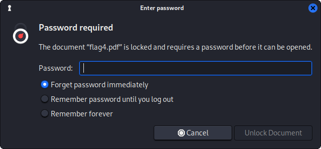

# ChallengeCeption

## Category
Forensic

## Estimated difficulty
Medium

## Description
The participants have to inspect a PCAP file of the solution to a previous challenge and retrieve 4 flags by extracting a plain text, a base64 encoded image, a custom encoded text, and an encrypted PDF respectively (all hidden in different network protocols). It concerns a modified version of the challenge GLaDOS.lan (CSCBE22) that had to be taken down due to deployment issues. The flags have been changed for obvious reasons.

## Scenario
We have captured the solution to a CTF challenge. Are you able to recover the flags?

## Write-up
The challenge presents a network capture:  


- Upon opening the file with Wireshark, we can see some usual network background chatter like ARP and ICMP requests. We can ignore these. If we take a closer look at the DHCP traffic however, we can see that the DHCP Offer from the server contains 2 special DHCP options: option 240 and option 230 which are both designated for private use. These 2 uncommon fields contain a quote from the video game Portal and the first flag of this challenge respectively.  
  
Note that this flag could also be found using `strings challenge.pcap | grep CSC`:  


- Almost immediately after the first DHCP exchange, we can see the client releasing its DHCP lease and requesting a new one using a specific "Vendor Class Identifier" option. This time, the DHCP server responds differently. It offers an IP address in another range, together with another Portal quote, a DNS server, a domain suffix and an error stating that the next flag is too big.  


- Again, the client renews it DHCP lease. This time using the "Vendor Class Identifier" and "Maximum DHCP Message Size" options.  


- In the last DHCP Offer of the network capture, we can see multiple option 230s.  


- By concatenating the values of these options (use "Copy As Printable Text") into a text file, we get a base64 encoded PNG file. Note that a part of the base64 string is stored in the "Option Overload" section of the packet. Writing the binary data to a file, reveals the second flag of this challenge.  
`cat ./flag2 | base64 -d > ./flag2.png`  


- After the DHCP exchanges, we can see a DNS request towards the provided DNS server. A little bit further, another DNS request but this time it concerns an AXFR request which asks for a zone transfer. Looking at the answers, we can see 3 records of interest: an A record for *central-ai-chamber*, a TXT record named *flag* and another TXT record named *scrambled-eggs-recipe*.  


- Both TXT records seem to be encoded, however the latter is not actually encoded but just a foreign language. If we translate the recipe we read the following.  


- If we execute the given instructions (see example Python script below), we recover the third flag:  
`CSC{The weighted companion cube DOES speak. The cake is a lie! #ZGNkg8PmpxzWkVMM}`  
```
def descramble_eggs(text):
	decoded=''
	for x in range(len(text)):
		decoded += text[x] + text[::-1][x]
	return decoded[:int(len(decoded)/2)]

flag = 'Fenk xpaaowLi .lzm ei Agc iWPspneGhuTek8isah3tbh!Vg  pT:eee MkeSm{ d  #MNkEoCC DcZ}GaOcS'
for x in range(4):
	flag = descramble_eggs(flag)

print(flag)
```

- What we see next in the network trace is a huge amount of raw TCP traffic. Looking a bit closer, we can see that the IP address of the *central-ai-chamber* DNS record is being targeted and each packet has a different destination port. We're looking at an active port scan. To find out which ports were active, we can apply a display filter in order to only show connections to which was responded, so called "SYN/ACK" packets:  
`(tcp.flags==0x12) && (ip.src == 192.168.255.38)`  
Doing this, we can see that only port 17 and 80 were online.  


- Right after the port scan, we can see a raw TCP connection to port 17 on 192.168.255.38. If we follow this stream, we get another Portal quote and a bunch of random text.  


- The random text are actually hexadecimal values. By converting these values to a binary file, we get an encrypted PDF file.  
`cat ./flag4 | xxd -r -p > ./flag4.pdf`  


- Looking further in the network trace, we see a lot of HTTP requests to different pages on that same host. We're looking at a directory enumeration. We can find the successful connections by filtering out the HTTP responses containing a "404 Not Found" error using the statement `http.response.code != 404`.


- Going through the successful HTTP responses, we discover 2 HTML pages containing more Portal quotes and a PNG image called *key.png*. Opening this file with the "Show Packet Bytes" function yields us the password for the PDF file: `79a6UfMGhzWSXMvz`  


- When we open the PDF file with the given password, we get some unreadable text however.  


- It turns out that the used font was not included correctly into the file. Manually copying the data and pasting it into any text editor will make the last flag readable.  


## PoC script
N/A

## Flags
**Flag1:** CSC{Stand back. The portal will open in 3, 2, 1... #uERB9xzxQ8FSJj6M}  
**Flag2:** CSC{Sentry mode activated. Are you still there? #x4MgsMEbbamcu48b}  
**Flag3:** CSC{The weighted companion cube DOES speak. The cake is a lie! #ZGNkg8PmpxzWkVMM}  
**Flag4:** CSC{This was a triumph. I’m making a note here: HUGE SUCCESS. #6e8xraAUk3sJuUNs}  

## Creator
Jelle Aerts

## Creator bio
--
