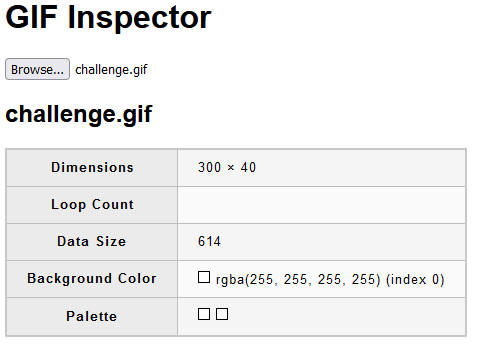

# Corrupted GIF 1

## Category
Stego

## Estimated difficulty
Easy

## Description
The participants have to change the values of the GIF color table.

## Scenario
This GIF file contained valuable information, but somehow it got corrupted...

## Write-up
The challenge presents a blank GIF image:

- By [inspecting the GIF image](https://movableink.github.io/gif-inspector/), we can see that its color table consists of 2 colors. These are both white.

- When we change one of the two colors using a hexadecimal editor and [the GIF image format](https://www.daubnet.com/en/file-format-gif) as reference, the flag becomes readable.

## PoC script
`sed -r 's/\xFF\xFF\xFF\xFF\xFF\xFF/\xFF\xFF\xFF\x00\x00\x00/g' ./challenge.gif > ./solution.gif`

## Flag
CSC{eLTKZXgMHwsdyZ4G}

## Creator
Jelle Aerts

## Creator bio
--
