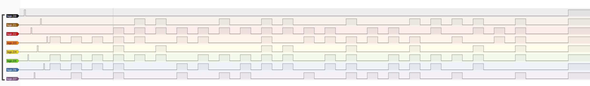

                                                                              **

# Signals

## Category

Misc

## Estimated difficulty

Medium

## Description

The challenge is about a 8 bit encoder that is used to encode a flag. A logic traces file is provided and contains 8 channels(1 bit per channel). The goal is to decode the bits to make bytes and therefore retrieve the flag.

## Scenario

My 90s home box has an integrated switch that has 8 ports, fancy huh?!. The each ports have a led, and those seems to blink kind of weird. At least, it doesn't seems to blink based on transiting packets.
I was able to hook a logic analyzer. Let us know if you find something weird ;)

## Write-up

A .vcd file is received, the file is a Value Change Dump file which can be opened by the well-known and opensource Sigrok PulseView app.
Once open it replays the file which give this result:

There are 8 channels, each of them represent a bit.
There seems to be a start sequence(short low-high-low at the beginning):

The ideas is that the sequence can be used to retrieve the bits positions.
|Position|8| 7| 6| 5| 4 |3 |2 |1|
|-|-|-|-|-|-|-|-|-|

The first low-high-low is the far left bit(8th), then the second, the 7th bit and so on.

So reordering the channels give this:
|Bit Position|8| 7| 6| 5| 4 |3 |2 |1|
|-|-|-|-|-|-|-|-|-|
|Channel| D0|D5|D2|D7|D4|D1|D6|D3|

Let's decode the first byte:

D3, D5 and D6 are high so base on the array we made above:
|Channel| D0|D5|D2|D7|D4|D1|D6|D3|
|-|-|-|-|-|-|-|-|-|
|Bit value |128| 64| 32| 16| 8|4 |2 |1|
|1st byte |0| 1| 0| 0| 0|0 |1 |1|
So 64+2+1 = 67 = "C"

Continuing with the 5 following bytes:

|Channel | D0|D5 |D2 |D7 |D4 |D1 |D6 |D3 |Int|Char|
|- |- |- |- |- |- |- |- |- | - | - |
|Bit value |128| 64| 32| 16| 8 | 4 | 2 | 1 | - | - |
|1st byte |0 | 1 | 0 | 0 | 0 | 0 | 1 | 1 |67 | C |
|2nd byte |0 | 1 | 0 | 1 | 0 | 0 | 1 | 1 |83 | S |
|3rd byte |0 | 1 | 0 | 0 | 0 | 0 | 1 | 1 |67 | C |
|4th byte |0 | 1 | 1 | 1 | 1 | 0 | 1 | 1 |123| { |
|5th byte |0 | 1 | 1 | 0 | 0 | 1 | 0 | 1 |103| e |
|6th byte |0 | 1 | 1 | 0 | 1 | 1 | 0 | 0 |108| l |
|...|...|...|...|...|...|...|...|...|...|...|

Decoding the whole thing gives "CSC{el3ctron1c_1s_fUn!}"

## PoC script

/

## Flag

CSC{el3ctron1c_1s_fUn!}

## Creator

Julian Dotreppe

## Creator bio

[The BIO will be shown to the participant when they solve your challenge(s), make sure you make it interesting!]

** REMOVE THIS NOTE **
** YOU CAN ALSO ADD LINK TO YOUR BIO, FEEL FREE TO REMOVE THEM IF NOT USED **
** REMOVE THIS NOTE **
[- link1]
[- link2]
[- link3]
