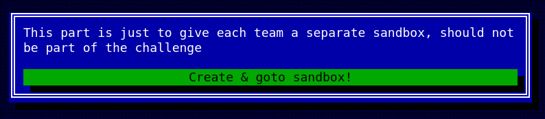
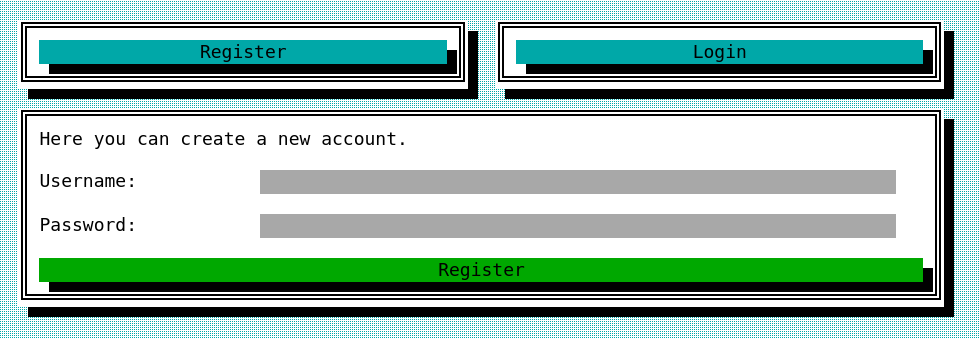
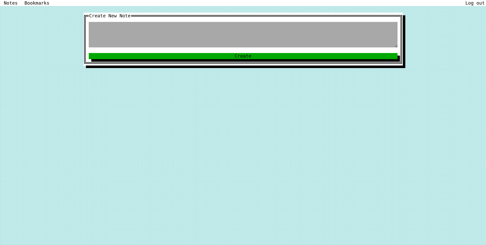

# THE_LOGICAL_ONE

## Category
Web

## Estimated difficulty
Medium

## Description
This challege used a SWI-Prolog webserver to create a simple note/bookmark keeping app.
The backend has an API used by the frontend. However a part of this API is designed to be very generic. Any 'object' can be PUSHed / GETed. One can thus push a custom session 'object' to gain access to the admin user an read its notes / bookmarks.

## Scenario
I make a brand new note & bookmark application. A mighty hand rolled frontend and a compact API in a logical backend!
I am so confident in my new application I store my most secretest secret on it!

## Write-up

Goto the given url. Once you are there u are greeted with a screen that is not part of the challenge. It creates a seperate sandbox for each team so that teams actions do not interfere with oneanother.



When You press the button you will be redirected to a new custom url. Here you are greeted with the login / register screen.



You create an account and login. Now you can see the application.



Now we are in the application we can look around at what it does and what kind of requests it makes. But first you need to find out what the goal is. When looking at the sandbox initialization code

```prolog
create_team_session(_Request) :-
  getenv('CHALL_PWD', Pwd),
  getenv('CHALL_FLAG', Flag),

  uuid(UUID, [version(4)]),
  asserta(team_session(UUID)),
  
  % Assert admin user in session.
  crypto_password_hash(Pwd, Hash),
  asserta(team_session_assertz(UUID, user(admin, Hash))),

  % Assert admin note containg flag in session.
  % The application expects notes to be base64 encoded.
  base64_encoded(Flag, Encoded, [as(atom)]),
  asserta(team_session_assertz(UUID, note(admin, Encoded))),

  reply_json(json([team_session=UUID])).
```

We see there is an admin user and it has a note containing the flag.

When looking at the request the application make you can notice it goes to a single endpoint: `/{Session}/api/action` supporting the POST and GET methods. 2 types of objects are queried and stored using the endpoint. `notes` and `bookmarks`. When checking the given code you can see that only the GET method properly authorized. Both endpoints are authenticated, but you can make a POST request to create a `note` or `bookmark` for another account. Any checks using the account Name are not present.

```prolog
read_term_from_atom(Item, ItemTerm, [syntax_errors(quiet)]),
% No free variables in Item.
ground(ItemTerm),
% Save Item.
asserta(team_session_assertz(Session, ItemTerm))
```
A POST request to `/{Session}/api/action?item=note('admin', 'WWVldFNrZWV0')` Will thus create a note in the name of the admin user. But we cannot use this to read the note.

When Checking the login code further you can find we store the session in the same fact database as the other 2 objects.

```prolog
asserta(team_session_assertz(Session, session(Name, UUID))),
```

We can abuse the information gained before to inject a session in de facts database used by prolog to add a know session key linked to the admin account.

Like this: `/{Session}/api/action?item=session('admin', 'knownkey')`. You can then simply change you browser cookie to the same known value an reload your page. The flag should be there under the notes tab.

## PoC script

[The Poc Script](./Resources/poc.py)

## Flag
CSC{ju5t_inj3ct_th3_f1ct_f2586e11}

## Creator
Francis Klinck

## Creator bio
I am a student Computer Science at UGent. Further I am the current president of ZeusWPI, the student association for Informatics at UGent. I also am happy to volunteer at events like the Student Kick-Off the CSCBE itself!

[- https://zeus.gent]
